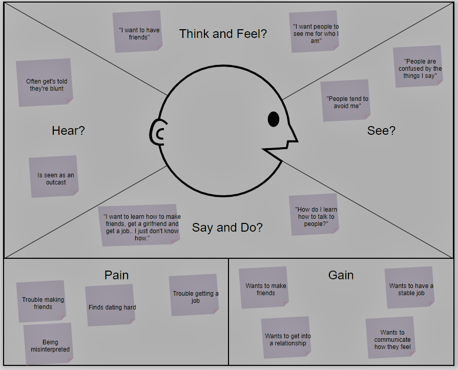
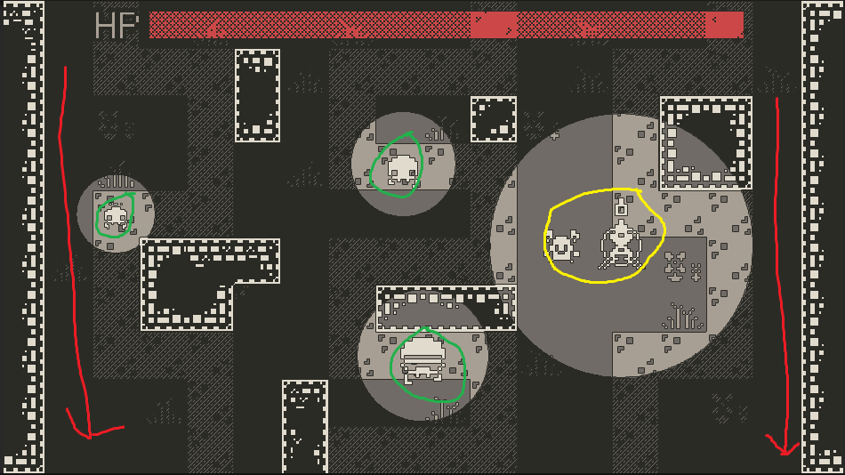
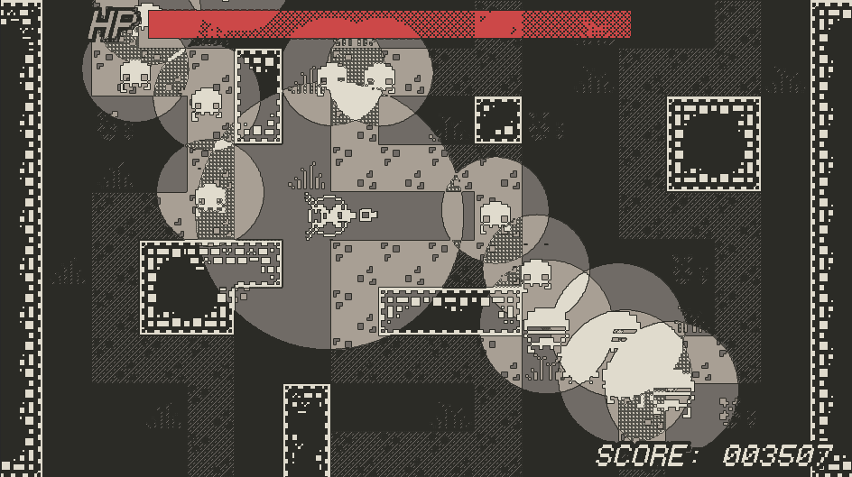
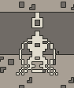
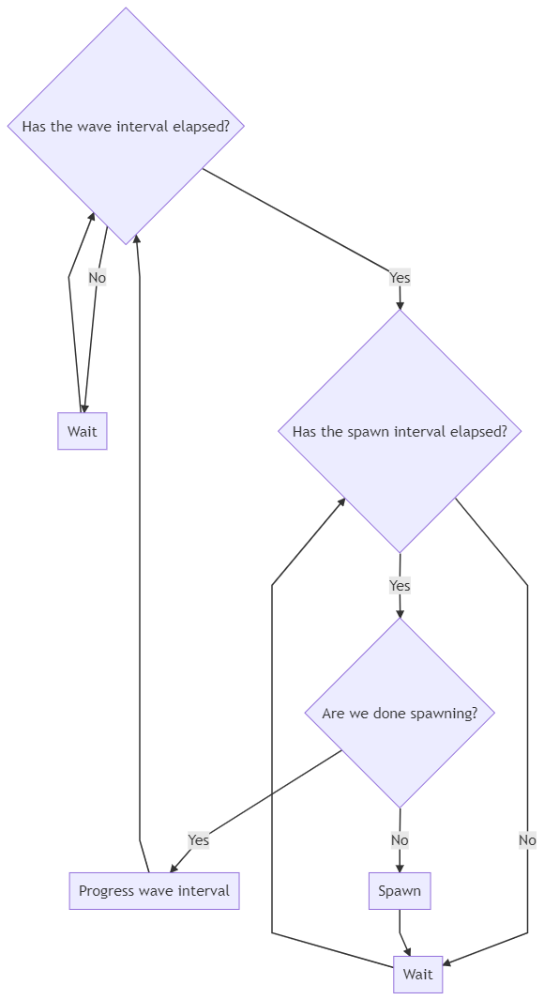
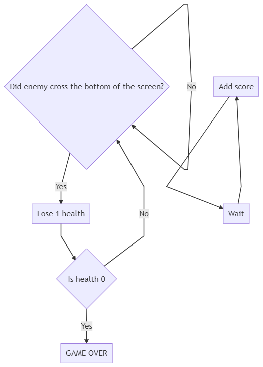
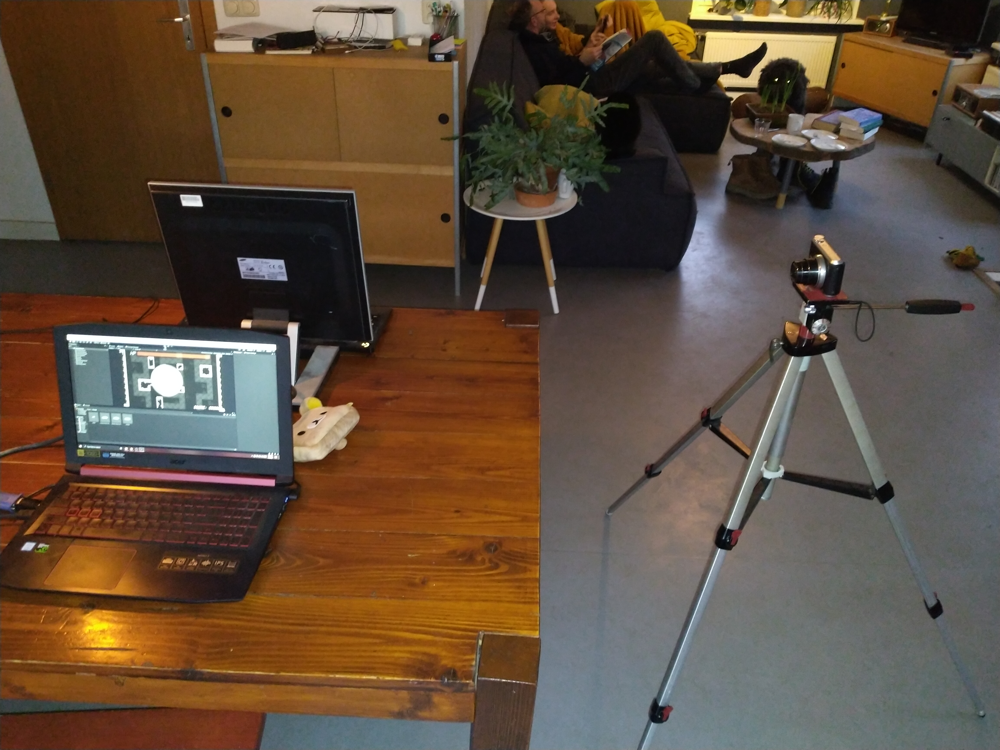

# Game development #2
- Pelle Bruinsma - CMV2E
- 389066
- Game development #2 (VIR1)
- 2nd year CMD - Game Design
- 15th of January 2021
- Stupidplusplus.com
> NOTE: this document has been written in markdown and can also be read [here](https://gist.github.com/Succyboi/81d7ae7002259934d07740930fbc6014).

# Contents
- [A short introduction](#A-short-introduction)
- [The case](#The-case)
    - [The assignment description](#The-assignment-description)
    - [My case](#My-case)
- [Research](#Research)
    - [Problems](#Problems)
    - [Empathy mapping](#Empathy-mapping)
    - [Bloom's taxonomy](#Bloom's-taxonomy)
    - [Solutions](#Solutions)
- [Concept](#Concept)
    - [Design guidelines](#Design-guidelines)
        - [Prioritize cooperative play](#Prioritize-cooperative-play)
        - [Stimulate communication](#Stimulate-communication)
        - [Employ non-threatening play](#Employ-non-threatening-play)
    - [Benchmark creation](#Benchmark-creation)
        - [Cooperation](#Cooperation)
        - [Socialization and communication](#Socialization-and-communication)
    - [Core concept](#Core-concept)
    - [Meeting requirements](#meeting-requirements)
- [The prototype](#The-prototype)
    - [How the game is played](#How-the-game-is-played)
    - [Enemy behavior](#Enemy-behavior)
    - [The players](#The-players)
        - [Player 1](#Player-1)
        - [Player 2](#Player-2)
    - [Other systems](#Other-systems)
        - [Enemy spawning](#Enemy-spawning)
        - [The game manager](#The-game-manager)
- [Testing](#Testing)
    - [Test plan](#Test-plan)
        - [Defining test objectives](#Defining-test-objectives)
        - [Defining test criteria](#Defining-test-criteria)
        - [Determining test deliverables](#Determining-test-deliverables)
        - [Test setup](#Test-setup)
    - [The deliverables](#The-deliverables)
        - [Recordings](#Recordings)
        - [Analysis](#Analysis)
- [Evaluation](#Evaluation)
    - [Test objectives](#Test-objectives)
    - [Improvements](#Improvements)
- [Sources](#Sources)

# A short introduction
Well hello there! As I am currently writing this it is the 1st of January, so happy new year!

I am starting my report now but as you probably know I have done some work for this project before this. I have created my prototype already and having done this without explicitly researching the case too much has lead me to work in sort of a backwards fashion. Which is why from this moment on I will be starting this report from scratch and reevaluate my prototype after I finish writing the [concept](#Concept) section.

Anyways, let's get started!

# The case
In this section we will discuss this project's case.

## The assignment description
To start things off in a structural manner I'll (ironically) first be going over what the assignment description section of this course on blackboard has to say about this project and its case.

The following description was found on blackboard:

> In the workshops of this course you have worked on various approaches, from theory and in practice, on translating a client’s desires / case problem into an actual game. For the final assignment, you are asked to:
> - Create a digital prototype of a game, based on the case problem, that shows your capabilities as a game developer.
> - Write a GDD explaining, why, how and what you have created and explain how your test went and what you would do with your results.

And the following example case:

> **Example case problem:**
>
> A healthcare institution which provides treatment for people with anger management > problems is looking for a game that can help them keep up with their treatment when they do not have sessions with their therapist.
>
> The Serious Game  that the student would design can assist the therapy. The game can be played in between therapy sessions, as a type of homework. For this specific example, so for the therapy and the game to work together you can assume the following requirements:
> - The therapist and patient meet up one time per week.
> - The therapist would like to see the progress of the patient and use this during their session.
> - The patients have various levels of issues
> - The therapist wants the patient to know what they are doing but it doesn’t have to look/feel like therapy.
>
> **Case problem**
>
> However, you are free to pick a healthcare case/therapy of your own, make sure to think about the 2 target audiences and the requirements (such as the example above) and that it incites behavioral change.

I am going to be lame and explain my joke: Saying that that going over the assignment description on blackboard is a structural manner to go about starting this document is hilarious because blackboard, although it is the main source provided to students for finding information on their subjects, usually contains outdated information, information that contradicts information provided to students in class (to no fault of their teachers) and usually raises more questions than it provides answers. But in an attempt to generate some sort of an immunity I always name the information stated on blackboard.

That being said, I will now go on to formulate my case for this project.

## My case
The assignment description states two requirements I need to meet for this project:
- I need to create a digital prototype of a game.
- I need to write a GDD explaining my creation, process, testing and findings.

The assignment description also provides an example case that was brought up during class numerous times. I will base my case on this example case, with one notable change being that, instead of creating a serious game that assists in anger management therapy, I will create a serious game that assists autistic people in training their social skills. Making my case the following:

> A healthcare institution which provides services for people with autism spectrum disorder is looking for a game that can help them keep up with their treatment when they do not have sessions with their therapist.

This case assumes the same requirements as the [example case problem](#The-assignment-description).

The reason why I would like the case to be specific to people with autism spectrum disorder is because I have a little brother that is autistic. Seeing how we are currently still in a pandemic, having access to someone in my target audience should help with some stages of this project. I am aware that it is generally a bad idea to use relatives as test subjects but considering the circumstances I'm sure you can agree that, in this case, with experts being hard to get a hold of and test subjects even harder, the advantages outweigh the disadvantages.

# Research
In this section we'll discuss research, problems, solutions and some theories.

## Problems
To start this section off let's go over some common symptoms of autism spectrum disorder.

> The current criteria for autism diagnosis require deficits in three social skills:
> - Social-emotional reciprocity 
> - Nonverbal communication
> - Developing and sustaining relationships
>
> *(DSM-5 Diagnostic Criteria)*

These criteria mean that, wherever a person may find themselves on the autism spectrum, they will, to some degree, have deficits in their social skills.

> "Impairments in social skills present many challenges for individuals with ASD. Deficits in social skills may lead to problems with friendships, romantic relationships, daily living and vocational success." 
>
> *(Barnhill, Outcomes in Adults With Asperger Syndrome)*

And these deficits mean that, without additional guidance or practice, autistic people may have trouble in making friends, dating, getting a job and in their daily lives in general.

## Empathy mapping
To possibly get some useful insights into our patients, let's create an empathy map:

## Bloom's taxonomy
In order to turn the aforementioned problems and empathy map into learning goals, let's use Bloom's taxonomy.

There are six levels to Bloom's taxonomy, these levels are:
> - Knowledge
> - Comprehension
> - Application
> - Analysis
> - Synthesis
> - Evaluation

Let's go over these levels and see where they apply to the problems and empathy map:

### Knowledge (To regurgitate facts without understanding)
Knowing that people on the autism spectrum disorder have deficits in social-emotional reciprocity and nonverbal communication we can lay a foundation for developing these social skills on knowledge. 

Social-emotional reciprocity is the back and forth interaction that takes place in communication. In the context of social-emotional reciprocity you could provide the patient with an image of a physical gesture and have them identify it.

This can be applied similarly to nonverbal communication. You could provide the patient with an image of a facial expression and have them identify it.

The learning goal that matches this level is the following:
> After passing this level, the patient is able to identify various physical gestures and facial expressions.

### Comprehension (To understand)
Similarly to how we did this in the previous level, in the context of social-emotional reciprocity, you could provide the patient with an image of a physical gesture and have them link it to its meaning. If the patient is able to do this then they understand this gesture and what its meaning is. 

The same thing can be done in the context of nonverbal communication. You could provide the patient with an image of a facial expression and have them link it to an emotion. If the patient is able to do this then they understand this facial expression and what its meaning is.

The learning goal that matches this level is the following:
> After passing this level, the patient comprehends the meaning of various physical gestures and facial expressions.

### Application (To put into practice)
In the context of social-emotional reciprocity you could provide the patient with a physical gesture and have them respond to this gesture verbally in an appropriate manner.

In the context of nonverbal communication you could provide the patient with a hypothetical situation and have them respond with a facial expression that matches this hypothetical situation. For example, "You see a homeless man eating a very out of date sandwich", they respond with an expression showing disgust.

The learning goal that matches this level is the following:
> After passing this level, the patient is able to respond to various physical gestures and situations appropriately.

### Analysis (To examine in detail)
In the context of social-emotional reciprocity you could provide the patient with an image of a physical gesture and have them give a number of reasons why they think the gesture represents what they think it represents.

In the context of nonverbal communication you could provide the patient with an image of a facial expression and have them give a number of reasons why they think the facial expression represents what they think it represents.

The learning goal that matches this level is the following:
> After passing this level, the patient is able to examine various physical gestures and facial expressions.

### Synthesis (To create something new)
This level is slightly hard to apply. Since there are only so many physical gestures and facial expressions known to man. And even outside that more specific context there is arguably nothing new to discover or create. Making the synthesis level in this context, at best, an opportunity for the patient to [apply](#Application-(put-into-practice)) the levels they've achieved so far in a more advanced way.

For example you could ask the patient: "Could you give me a situation in which you would make the following facial expression?".

Because of what I just discussed I am unable to establish a learning goal that matches this level.

### Evaluation (To justify)
In the context of social emotional reciprocity you could provide the patient with a physical gesture and a response, one of these two could be inappropriate. Then ask the patient to evaluate wether the use of the gesture or the response is appropriate and have them reason why so.

The same thing can be done in the context of nonverbal communication. You could provide the patient with a facial expression and an emotion, one of these two could be inappropriate. Then ask the patient to evaluate wether the use of the facial expression or the emotion is inappropriate and have them reason why so.

The learning goal that matches this level is the following:
> After passing this level, the patient is able to justify the use of various physical gestures and facial expressions.

### A short afterword
Out of the [three required deficits](#Problems) for an autism diagnosis I specifically scope in on social-emotional reciprocity and nonverbal communication as the third required deficit is simply a symptom of the first two.

In the provided explanation for each level I use physical gestures and facial expressions a lot since they are prime examples of social-emotional reciprocity and nonverbal communication.

## Solutions
So now that we know some of the problems autistic people deal with we can start thinking about some solutions to these problems. I'd like to start of by listing some uses for video games in therapy that we can use to our advantage:

> Below are some reasons why utilizing video games in treatment is useful:
> - Socialization
> - Cooperative play
> - Social skills
> - Ice breaker
> - Resourcing
> - Grounding
> - Non-threatening
> - Family bonding
> - Self-esteem/confidence building
>
> *(Legault, Utilizing Video Games in Treatment)*

I'd like to scope in on "Socialization" and "Cooperative play":

> **Socialization**
>
> When we first learn how to communicate, it is not with words but with non verbal methods. Such as facial expression, through play, body language. So when a client does not want to speak, utilizing video games is a wonderful way to return to the basics of communication, and then bring in the verbal socialization. As seen next in co-op play, socialization through non threatening play can build rapport and increase socialization.
>
> *(Legault, Utilizing Video Games in Treatment)*

> **Cooperative play**
>
> It can be easily rehearsed to speak to someone one on one. But what happens when we throw a task into the mix. Individuals often are unsure of how they communicate with others, but are often told they are brash, unapproachable, or even too timid. Through co-op play, these things are highlighted and then can be discussed, worked through in game, and utilized in the real world.
>
> *(Legault, Utilizing Video Games in Treatment)*

There's a few important things we can take away from these sections specifically:
- Games can be used to instantiate basic communication and ease into verbal socialization. This means we can use gaming in order to stimulate communication and, if we play our cards right, we can even turn this communication into socialization, which can help practice social skills.
- Cooperative play can put communication into a more realistic environment. By mixing in tasks communication becomes a background task, similar to how you might encounter it in your daily life. This means that practicing communication through play can be far more meaningful than simple rehearsal.
- Cooperative play can highlight deficits in a person's social skills. This may be less useful for us to know in helping the player practice their social skills but is a valuable insight for the therapist.

Next I'd like to briefly scope in on "Non-threatening".

> **Non-threatening**
>
> Life can come too much too fast at times, but with games they can be put down, discussed, paused, and the individual can reorient themselves to the situation. Thus building confidence to work through a situation without the threatening aspect that causes our survival response to kick in, preventing the thinking brain from being able to assess and respond to the situation.
>
> *(Legault, Utilizing Video Games in Treatment)*

The most important thing we should take away from this section is that the potential that games have for non-threatening play. Non-threatening play can help in distracting the player: "preventing the thinking brain from being able to assess and respond to the situation". This is important to us since if we want to give our therapist an accurate measure for a patient's progress we should try to simulate a real environment that a patient could encounter. Non-threatening play can help here by distracting the player from the fact that what they're doing is just "homework therapy".

# Concept
In this section we'll define the serious game's concept.

## Design guidelines
Based on the research I talked about in the previous section I will now establish and briefly explain a number of design guidelines for the serious game. These design guidelines being the following:
- Prioritize cooperative play.
- Stimulate communication.
- Employ non-threatening play.

### Prioritize cooperative play
Cooperative play helps put communication into a realistic environment. This is important to the therapist both for confirming the credibility of a patient's progress and for getting additional insight into deficits in the patient's social skills. 

Furthermore the use of cooperative play can push the serious game's purpose beyond being a tool for measuring a patient's progress into being a tool for the patient to practice their social skills individually.

The usefulness of cooperative play is incredible and needs to be prioritized.

### Stimulate communication
Games as a medium can be used by players as an expressive tool that doesn't require verbal or physical non-verbal communication. This significantly lowers the barrier of entry required for player communication. It is in our interest to lower this barrier of entry as much as possible since basic communication is the gateway to socialization and this is what allows the player to practice their social skills.

If we want to use the serious game as a tool for the patient to practice their social skills it is in our best interest to stimulate communication.

### Employ non-threatening play
Non threatening play helps "disguise" our serious game, a tool created for therapeutic purposes, as an entertainment game, created for entertainment purposes, to the player. This disguise is useful to us as it helps put communication into a realistic environment, which has the same benefits as mentioned in [cooperative play](#Prioritize-cooperative-play).

## Benchmark creation
Before we get to defining our serious game's core concept it might be useful to take a look at some existing games that, to some degree, already fit our design guidelines. After all co-op in itself is a genre, which means that we can maybe find some good ideas lying around.

### Cooperation
The following games I'll be mentioning will primarily prioritize cooperative play. Furthermore I'll be excluding games that label themselves as cooperative only for the reason that the game can potentially be experienced by two players simultaneously. It's unfortunately common in the co-op genre to contain games that are simply singleplayer experiences with multiplayer shoved into them, these games don't require or even benefit from cooperation. For this reason I'll only include games that specifically benefit or require player cooperation.

#### Lego star wars
To start things off easy. Lego star wars is a really easy and straightforward game. Its gameplay is extremely streamlined with linear maps that the game almost pushes the player through, often players can complete levels just by walking around and pressing the attack button. One exception to this trend are mini puzzles that, while often not mandatory, require player collaboration in order to be completed. These puzzles are usually quite simple but force players to work together, using player positioning or character abilities to do so.

#### Overcooked
Overcooked is another great example of forcing players to work together through player positioning. In overcooked players work together in a kitchen, the game is fast paced and made engaging by providing time limits, exponential penalties for failure and purposefully inconvenient map design. Especially the unforgivingness of the game and its inconvenient map design force players to work together in order to progress. Usually the games earlier stages are more forgiving, being a more "party suited" kind of gameplay, while later stages have a significantly higher difficulty, requiring players to set up very specific strategies in order to maximize efficiency. Late game Overcooked is the king of cooperative play.

#### Keep talking and nobody explodes
KTaNE does what overcooked does but in a more binary format. In this game player cooperation is forced in the sense that, one can NEVER complete the game without another player. In KTaNE players attempt to defuse a bomb by completing a series of puzzles on the bomb's enclosure. One player describes what they're seeing on screen and another player explains to the other what to do, what wires to cut, what buttons to press, et cetera. One player can not complete the game without the other.

### Socialization and communication
Although unlike cooperation there is no specific genre to socialization and communication there are a few games I'd like to mention for benchmarking purposes.

#### Overcooked
There the game is again! I am mentioning overcooked twice because it does really well at something else besides forcing players to cooperate. Overcooked, mainly thanks to its unforgvingness and reliance on cooperation for player progression, manages to instantiate communication. Actually I feel we should take it one step further: Overcooked manages to make you yell at your player two, more easily than you think. Although we must realise that making players potentially yell at each other may not be a great idea, the level towards which the game instantiates communication between players can be controlled primarily using difficulty scaling.

#### Minecraft
I'm mentioning Minecraft briefly, because although it's not necessarily a cooperative game, it allows players to convey their emotions through virtual body language, without explicitly using emotes even. To give some context to what I'm talking about, in the game you can crouch by the press of a button. In an online setting, spamming this crouch has different meanings: If a player is in combat with you, you might spam crouch to convey that you propose a truce or temporary ceasefire. If you see a player from a far distance away, you can let them know you mean no harm by spamming crouch as well, crouching repeatedly generally is used to convey friendliness. Similarly if you want to capture the attention of another player you can repeatedly jump in the air while pounding your fist in the air. These are just a few examples of the virtual body language that Minecraft uses. We can take this game as an example of non-verbal communication and socialization.

## Core concept
Alright so now it's time to define our concept. Just to refresh, the following is this project's case problem:

> A healthcare institution which provides services for people with autism spectrum disorder is looking for a game that can help them keep up with their treatment when they do not have sessions with their therapist.

In order to meet this case problem I've come up with the following serious game concept:

> The serious game is a cooperative tower defense game that, forces players to cooperate and communicate, allows patients to practice their social skills and provides the therapist with useful insights into a patient's progress.

In this context, when I refer to the tower defense genre I am taking inspiration from a game named [Towerbag](https://matheuscunegato.itch.io/towerbag).

I feel that tower defense works well in the context of my design guidelines:
- Cooperative play works since we have two players (the tower and the player). 
- We can control the level of difficulty easily by increasing the number of enemies on screen. 
- We can force players to cooperate and communicate by giving players different abilities, making them dependent on each other.
- We can further force players to cooperate by providing individual players with different amounts of information or feedback, similar to how [Keep talking and nobody explodes](#Keep-talking-and-nobody-explodes) does this.
- We can measure progress linearly as and provide this to our therapist as an insight into our patient's progress.

## Meeting requirements
I'd briefly like to go over some of the requirements that the [case problem](#My-case) assumes and how the serious game's concept intends to meet them.

> The therapist and patient meet up one time per week.

Okay... Bad start we have no control over this requirement.

> The therapist would like to see the progress of the patient and use this during their session.

There are a number of insights we can provide our therapist with. As I mentioned previously, tower defense gameplay where the only method of progress is cooperation, allows us to measure progress linearly and provide this to our therapist as an insight into our patient's progress. Although most likely the therapist is more interested in how well the patient can socialize rather than cooperate, it is an important statistic seeing how cooperation requires communication and communication is the gateway to socialization. 

Additionally we can provide the therapist with both screen recordings as well as camera footage and audio. This does require us to choose a platform that can reasonably capture these media, with the most reasonable candidate being the desktop platform (PC/Mac/Linux).

> The patients have various levels of issues

This requirement is incredibly vague. I'm honestly not sure what this requirement is implying...

> The therapist wants the patient to know what they are doing but it doesn’t have to look/feel like therapy.

This requirement is very straightforward, part of this is out of our hands since it's up to the therapist to inform the patient about the use of our serious game. But the second part of this requirement we have control over, even though it's barely even a requirement. This part of the requirement relates to [Non-threatening play](#Employ-non-threatening-play).

# The prototype
Based on the serious game concept I developed the following prototype:

In this image you can see the following:
- (Marked in yellow) The two players, the left will be referred to as PLAYER 1 and the right will be referred to as PLAYER 2.
- (Marked in green) Three types of enemies.
- (At the top of the screen) The health bar.
- (In the background) Three paths that enemies can follow, enemies will spawn at the top of the map and follow them on their way down.

I will now explain some specific information about the prototype.

## How the game is played
The game is played like a classic arcade game, the game doesn't have a win state but is instead high score based. 

In order to achieve a high score players will need to communicate enemy positions, drag the other around and shoot enemies.

Enemies will spawn at the top and follow a path to exit the screen on the bottom. If enemies exit the screen on the bottom player health will go down.

If player health reaches zero the game ends.

## Enemy behavior
All enemies share a common class, we will refer to this class as "the enemy class". The enemy class has the following important variables: 
> - HEALTH - Defines the amount of damage an enemy has to take before dying.
> - MOVEMENT SPEED - Defines how fast the enemy moves.
> - ATTACK RADIUS - Defines the area around the enemy in which the enemy will attack PLAYER 1.

Enemies come in three sizes:

(From left to right)
> - SMALL - High MOVEMENT SPEED, low HEALTH.
> - NORMAL - Medium MOVEMENT SPEED, medium HEALTH.
> - SMALL - Low MOVEMENT SPEED, high HEALTH.

The game features different kinds of enemies in order to make gameplay more interesting and challenging in order to distract the player. This is talked about in [Employ non-threatening play](#Employ-non-threatening-play).

I know that you either really like flowcharts or the curriculum requires you teach about them in class. Either way personally I don't really have much use for them but for your sake I'll include the following flowchart that describes the enemy behavior:

As you can see the player's behavior is very straightforward, an enemy always follows either the player or their path.

## The players
PLAYER 1 and PLAYER 2 operate differently. I will describe both their roles briefly.

PLAYER 1 can move around the map at will and drag around PLAYER 2 using a rope. They attract enemies but cannot harm them.

Player 2 can't move around the map but they can harm enemies by shooting.

Additionally PLAYER 1 and PLAYER 2 receive different amounts of feedback and/or information, more specifically, PLAYER 2 can't see enemies, this is done in order to force players to cooperate, this is talked about in [core concept](#Core-concept).

This is what PLAYER 1 sees:

And this is what PLAYER 2 sees:

### Player 1

PLAYER 1's class has the following important variables:
> - GRAB RANGE - Defines the range in which PLAYER 1 can latch onto PLAYER 2 in order to drag them around.
> - MOVEMENT SPEED - Defines how fast the enemy moves.

PLAYER 1 has the following controls:
> - W, A, S, D - To move.
> - SPACE BAR - To drag PLAYER 2.

### Player 2

PLAYER 2's class has the following important variables:
> - FIRING SPEED - Defines the rate at which bullets are fired.
> - AIM DAMPING - Defines the speed at which aim direction can change.

PLAYER 2 has the following controls:
> - UP, LEFT, DOWN, RIGHT - To move.

## Other systems
I'll now go over some other important systems in the game.

### Enemy spawning
The enemy spawning system takes care of, well... Spawning enemies... Let's talk about that!

The enemy spawning system's class has the following important variables:
> - ENEMIES PER WAVE - Defines how many enemies will be spawned each wave.
> - SPAWN INTERVAL - Defines the amount of time between each enemy spawn.
> - WAVE INTERVAL - Defines the amount of time between each wave.
> - PROGRESS PER WAVE - Defines how much the WAVE INTERVAL will progress from its starting interval to its shortest interval.

And here's a flowchart describing the enemy spawning system's behavior:

### The game manager
The game manager keeps track of player score, health and the game lose state.

The game manager's class has the following important variables:
> - MAX HEALTH - Defines the health that players will start with at the start of the game.
> - CURRENT HEALTH - Defines how much health players currently have.
> - SCORE PER SECOND- Defines by how much score should increase per second.

And here's a flowchart describing the game manager's behavior:

# Testing
In this section we'll talk about testing.

## Test plan
It's time to start testing the prototype, but before we do let's create a test plan. In order to create a test plan we'll be going through the following steps:
> - Defining test objectives.
> - Defining test criteria.
> - Determining test deliverables.

Starting with...

### Defining test objectives
So in order to define our test objectives we need to find out what we want to test and why we want to test it. Let's make a list:

> - Cooperative play - We want to know how and how well players are cooperating.
> - Communication - We want to know how and how well players are communicating.
> - Non-threatening play - We want to get insight into the serious game's verisimilitude as an entertainment game.
> - Difficulty - We want to make sure the game's difficulty is optimal.
> - Accessibility - We want to know if players can reasonably play the game.

I'd first and foremost like to test the representation of the game's [design guidelines](#Design-guidelines) and see if they were optimally put into practice. We need to test this since, without having our design guidelines optimally represented in our prototype, our prototype is useless.

Besides this we should also test the game's difficulty, we need it to be optimal for our prototype to be useful. If the game is too hard, players will be done in a short amount of time, meaning they did not get to communicate and cooperate as much, making the prototype less useful. If the game is too easy, communication and cooperation is not as important anymore, making the prototype less useful.

Lastly we should test accessibility. If we are going to test patients we need to make sure that they are reasonably able to play the game. Because if a players can't interact with the game optimally then the game will no longer be properly disguised by non-threatening play, whatever data we collect for the therapist will lose credibility and difficulty is affected.

### Defining test criteria
In order to meet our test objectives we need to establish our test criteria, when are our objectives reached?

First of all, I'd like to again mention the situation we're in, because of the pandemic that is still going on at the moment and because the prototype is local co-op I do not have access to quantitative testing. However as I mentioned [earlier](#My-case) I do have access to qualitative testing:

> The reason why I would like the case to be specific to people with autism spectrum disorder is because I have a little brother that is autistic. 

Besides my brother I will test with one more person, my dad. He is relatively unexperienced with video games and does not have autism spectrum disorder. This means that he is possibly more useful for accessibility testing than my brother, seeing how my brother is relatively experienced with video game, and his data is useful for comparisons we can make to possibly identify specifically ASD related issues.

Again I would like to mention I am aware that it is generally a bad idea to use relatives as test subjects but considering the circumstances I'm sure you can agree that, in this case, with experts being hard to get a hold of and test subjects even harder, the advantages outweigh the disadvantages. These two test subjects is unfortunately the best I can do.

Be that as it may, for the sake of appearing like a super duper professional research person I will from this point on be referring to my little brother as SUBJECT1 and to my dad as SUBJECT2:

> SUBJECT2 (my brother)
> - Has autism spectrum disorder.
> - Is relatively experienced with video games.

> SUBJECT2 (my dad)
> - Does not have autism spectrum disorder.
> - Is relatively unexperienced with video games.

> ME
> - Does not have autism spectrum disorder
> - Is relatively experienced with video games.

I will be conducting three rounds of testing:
1. Multiple game rounds of co-op play testing between ME and SUBJECT1.
2. Multiple game rounds of co-op play testing between ME and SUBJECT2.
3. Multiple game rounds of fly-on-the-wall co-op play testing between SUBJECT1 and SUBJECT2.
4. Multiple game rounds of A/B fly-on-the-wall co-op play testing between SUBJECT1 and SUBJECT2

I am starting off with two testing rounds between me and each subject, so I can gather information from these tests and compare the sessions afterwards. In an attempt to remove bias from participating in co-op play testing myself and in order to simulate a more realistic environment I am only observing during the third and fourth round of testing.

The last round of testing I am doing an A/B test in order to establish wether it is useful to give PLAYER 2 minimal visual clues as to where the enemies are on screen. By default this is what PLAYER 2 sees: 

Notice the small grey circles along each path, these are locations of the game's enemies. In the interest of cooperative play and socialization I will test to see if it is useful to have these visual clues in the game.

I also considered doing a focus group with both subjects after the third round of testing but decided that due to the incredible bias that comes with using relatives in testing it would be a bad idea to use any kind of Q&A format and decided against it.

### Determining test deliverables
For each test I will be recording the subjects using a camera and [OBS Studio](https://obsproject.com/). Which means we will have the following deliverables:
- A video recording of each session.
- A screen recording of each session.
- A written analysis of each testing session.

### Test setup
I will be performing the tests using the following setup:

## The deliverables
I have now done my testing and have come out with the following deliverables:

### Recordings
The following recordings are in Dutch:
- [Session 1](https://youtu.be/4K9SxZ_VPWE) (Screen recording)
- [Session 1](https://youtu.be/gUkZTvZfBpM) (Video recording)
- [Session 2](https://youtu.be/Z4_z7HYorAM) (Screen recording)
- [Session 3](https://youtu.be/Nwko8T6ZNFc) (Screen recording)
- [Session 4](https://youtu.be/or_pexHdmfY) (Screen recording)

Unfortunately I had some trouble making video recordings and only came out with one recording of the first session. The recording is also very low quality so I doubt that we will get much use out of it but hey it's there.

### Analysis
> Session 1 (Multiple game rounds of co-op play testing between ME and SUBJECT1)
> - Communication starts of slightly slow as SUBJECT1 learns how to play the game.
> - After a few minutes of playing communications becomes strong.
> - A little after midway though the session SUBJECT1 comments on the games visuals and connects them to their own experiences that they then proceed to briefly talk about, SUBJECT1 is socializing.
> - Later into the session SUBJECT1 seems to be slightly overwhelmed by the amount of enemies on screen and has a hard time describing their positions to ME.

> Session 2 (Multiple game rounds of co-op play testing between ME and SUBJECT2)
> - Communication starts and remains slow all throughout the first half of the session. Communication was very one sided, mostly coming from ME with little to no response coming from SUBJECT2. This is possibly due to them still having to get a hang of the game as communication later on becomes stronger.
> - In the second half of the session SUBJECT2 communicates far more, seeing how they now need to communicate the enemy positions to ME. Still in comparison to SUBJECT1 communication is weaker with SUBJECT2.
> - SUBJECT2's performance (in terms of in-game score) was underwhelming in comparison to SUBJECT1's performance both the first and second half of the session.

> Session 3 (Multiple game rounds of fly-on-the-wall co-op play testing between SUBJECT1 and SUBJECT2)
> - From the start SUBJECT2 seems to be a lot more communicative, this could be because they now know how to play the game but it could also be because the subjects feel more comfortable when they aren't being observed.
> - In the first half subjects perform (in terms of in-game score) poorly in comparison to previous sessions.
> - In the second half subjects seem to perform a lot better, while being more communicative as well, even dabbling into socialization. This could be because SUBJECT1 is now in charge of PLAYER2, which is possibly a role that requires more player experience or skill.
> - The second half players perform surprisingly well, communicating and cooperating efficiently and achieving a high-score.

> Session 4 (Multiple game rounds of A/B fly-on-the-wall co-op play testing between SUBJECT1 and SUBJECT2)
> - Communication this session was at an all time low. With at most one way communication coming for SUBJECT2. It seemed that without giving SUBJECT1 any feedback the game was incredibly boring to them as they became a delayed input method to SUBJECT1.
> - Subjects also performed incredibly poorly, worse than every session so far.
> - It appears that the lack of player feedback made this session terrible in every way.

# Evaluation
So now that we've collected all the testing deliverables, let's go over some things we discovered.

## Test objectives
First let's go over all the test objectives and see what we found.

> Cooperative play
>
> The prototype does very well at forcing players to cooperate. Players seem to be very aware that they can't progress without working together. However giving players different amounts of visual feedback through splitting their game view in order to force them to cooperate has some problems that we'll take about in [improvements](#Improvements).

> Communication
>
> The prototype also does very well at stimulating communication, there is always someone talking while playing. Communication can at times be slightly one sided though, seeing how one player cannot see enemies that well this forces the other player to inform them on the enemy positions in order to progress. Although this does stimulate communication on that player's end, it can make things a bit lopsided at times.

> Non-threatening play
>
> Players appear to be immersed in playing the game, never once having the serious game's verisimilitude as an entertainment game break. Players even commented on the games visuals, describing enemies to look like beetles or walls to be made of glass. The fact that players bring this up indicates the player is too immersed in playing the entertainment game for its illusion to break and reveal the serious game underneath.

> Difficulty
>
> With the only exception being testing session 4, players never seemed to struggle with the games difficulty. It never being too low to bore players and never too high to frustrate them, difficulty as it is in the prototype right now can be considered ideal.

> Accessibility
>
> Players quickly got a hang of the game's controls both in the case of PLAYER1 and PLAYER2. The only occurrence of anything that could be considered an accessibility problem is during session 1 when SUBJECT1 appeared to be slightly overwhelmed by the amount of enemies on screen. This could be a problem that is specific to ASD seeing how SUBJECT2 never appeared to become overwhelmed. We do not wish to overwhelm players as it is counterproductive to the serious game's goal.

## Improvements
So now let's get onto the final part of the report, as blackboard describes it:
> A short evaluation explaining how you could improve upon your existing prototype in order to make it a better prototype for the future.

So here are the improvements I'd make to my existing prototype:
- Add layers of polish that have not yet been applied like non prefabricated graphics, audio, etc.
- Add additional player feedback, on one hand this could be interpreted as just adding more layers of polish to the prototype what I actually mean here is the following: We saw in the final testing session that PLAYER2 needs visual feedback to make the serious game effective and entertaining. The current solution to this is incredibly simple, PLAYER2 now just sees small circles where the enemies are supposed to be but even having just that has an immense payoff. However since this solution is so simple there could definitely be a lot of untapped potential here. The next iteration of this prototype could experiment with giving PLAYER2 feedback in different ways like providing them with a limited view cone or only showing the player an animation when they've shot an enemy, giving them a view range, et cetera.
- Then there's another question. Seeing how limiting the amount of feedback PLAYER2 receives seems to bore players and make the prototype far less effective should this measure be there in the first place? Obviously this measure was put in place for a reason but further testing is needed to find the answer to this question. Additionally having only a single screen setup makes the prototype so much more accessible to an audience that the removal of this measure should be considered regardless, although a split screen setup could obviously also prove a worthy solution.
- Further testing is required ro find out wether the game tends to overstimulate patients. If so a more natural art style or fewer visual stimuli need to be featured.

So that's it. Thank you for reading

# Sources 
> - Barnhill, G. P. (n.d.). Outcomes in Adults With Asperger Syndrome. - Used in [Research](#Research).

> - DSM-5 Diagnostic Criteria. (n.d.). Retrieved January 01, 2021, from https://iacc.hhs.gov/about-iacc/subcommittees/resources/dsm5-diagnostic-criteria.shtml - Used in [Problems](#Problems).

> - Legault, A. (2019, July 15). Utilizing Video Games in Treatment. Retrieved January 01, 2021, from https://amberlegaultlmft.com/utilizing-video-games-in-treatment/ - Used in [Solutions](#Solutions).